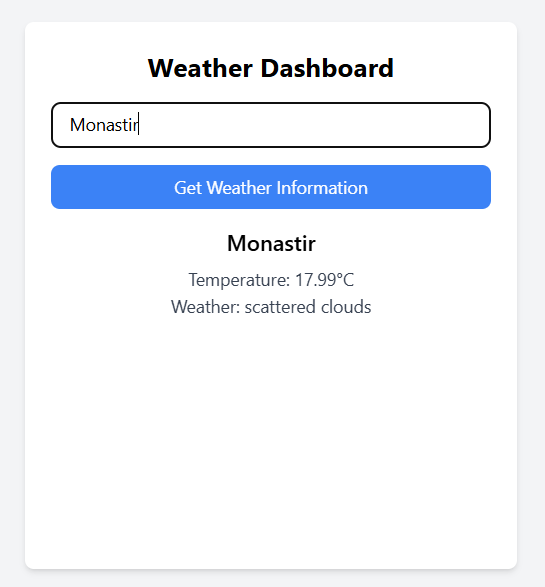

# Weather Dashboard

A simple React-based weather dashboard that fetches and displays real-time weather data from the OpenWeather API. This app allows users to search for weather information by city and view details such as temperature and weather description.

## Demo

You can view the live demo of this project here:  
[Weather Dashboard Demo](https://medbendakkoum.github.io/weather-app)

## Features

- Fetches current weather data from the OpenWeather API.
- Displays temperature and weather conditions for a specific city.
- Provides real-time weather updates.
- Simple and clean user interface using TailwindCSS.

## Technologies Used

- **React**: JavaScript library for building user interfaces.
- **OpenWeather API**: Provides weather data.
- **TailwindCSS**: Utility-first CSS framework for styling.

## Screenshots



## Getting Started

To run this project locally, follow the steps below:

### Prerequisites

- [Node.js](https://nodejs.org/) (LTS version recommended)
- An API key from [OpenWeather API](https://openweathermap.org/api) for fetching weather data.

### Installation

1. **Clone the repository**:

   ```bash
   git clone https://github.com/medbendakkoum/weather-app.git

   ```

2. **Navigate to the project directory:**

   ```cd weather-app

   ```

3. **Install dependencies:**

   ```npm install

   ```

### Setup OpenWeather API key

4. **Set up your OpenWeather API key:**
   -Create a .env file in the root of the project.

-Add your API key:

```REACT_APP_OPENWEATHER_API_KEY=your_api_key

```

### Running the Application

5. **Start the development server:**

   ```npm start

   ```

   The app will be available at `http://localhost:3000`.

   ### Building for Production

To create an optimized production build, run:

```bash
npm run build
```

The production-ready files will be located in the `build` folder.

## Deployment

This project can be easily deployed using platforms like [Netlify](https://www.netlify.com/) or [GitHub Pages](https://pages.github.com/).

### Deploying to Netlify

1. Build the project:
   ```bash
   npm run build
   ```
2. Use the Netlify CLI:

   ```bash
   npm install -g netlify-cli
   netlify login
   netlify init
   netlify deploy --prod
   ```

   ### Deploying to GitHub Pages

3. Install the GitHub Pages package:
   ```bash
   npm install gh-pages --save-dev
   ```
4. Add the following scripts to your `package.json`:
   ```json
   "homepage": "https://MedBenDakkoum.github.io/weather-app",
   "scripts": {
     "predeploy": "npm run build",
     "deploy": "gh-pages -d build"
   }
   ```
5. Deploy to GitHub Pages:
   ```bash
   npm run deploy
   ```

## License

This project is licensed under the MIT License. See the [LICENSE](LICENSE) file for details.

## Author

**Mohamed Ben Dakkoum**

Feel free to contribute or report issues!
